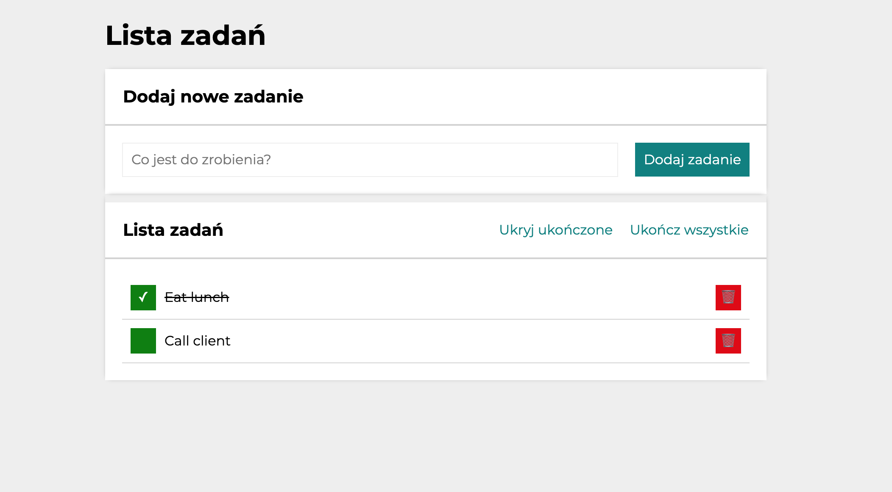

# To-Do List

## DEMO

[To-Do List - demo](https://rudolfini.github.io/todo-list/)

## Description

Simple To-Do List application using JavaScript. Add a new task to do, cklick the green button if it is done and hide done tasks with "Ukryj ukończone". You can mark all tasks as 'done' using "Ukończ wszystkie" button.  Use the red button to remove task from the list. 

## Technologies

- HTML
- CSS
- JavaScript
- Flex
- Grid
- BEM
- ES6+
- GIT